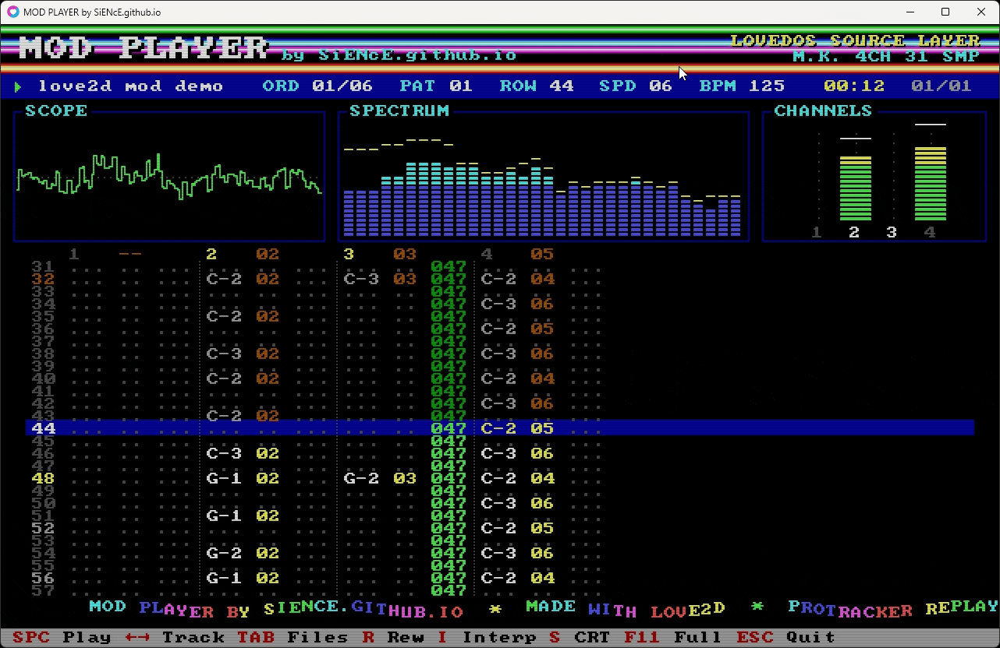

# MOD PLAYER by [SiENcE.github.io](https://SiENcE.github.io)



## Quick start

A MOD player made in love2d (lua) without additional dependencies

Runs on [LÖVE](https://love2d.org) 11+ and on [LoveDOS](https://github.com/rxi/lovedos).
The player core follows the FireLight MOD tutorial in [`doc/FMODDOC.TXT`](doc/FMODDOC.TXT).

```
love .                      # plays the last song, or DEFAULT_MOD (set at the top of main.lua)
love . MUSIC/demo.mod      # play another file (LÖVE 11)
```

Put your own MOD files in `MUSIC/`. That folder is not in git, because we have no rights to redistribute other people's modules. If no MOD is found (e.g. right after cloning), the player plays `demo.mod`. It's an original song made for this player: the samples were synthesised and the patterns written in code.

## Desktop: retro tracker UI

On desktop LÖVE the player looks like a 1994 DOS tracker:
- **Screen:** a fixed 640×400 canvas (VGA 80×50 text geometry), scaled by whole numbers only, with the 16-colour VGA palette and an 8×8 bitmap font.
- **Header:** raster bars behind the title.
- **Panels:** an oscilloscope, a 32-band spectrum analyser and LED-style VU meters per channel.
- **Pattern view:** a colour-coded ProTracker pattern view with already-played rows dimmed.
- **Extras:** a sine scroller (credits plus the song's sample names), optional CRT scanlines and a file browser.

The display is synced to what you hear, not to what was last mixed. The scope and spectrum also work with the LoveDOS backend: on desktop it runs the mixer silently just to feed them.

| Key | Action |
|---|---|
| `Space` | play / pause (restarts a song that ended with `F00`) |
| `←` `→` | previous / next MOD in the folder |
| `Tab` / `B` | file browser (`↑↓` select, `Enter` open, `Backspace` up) |
| `R` | back to the start of the song |
| `I` | linear interpolation on/off (mixer) |
| `S` | CRT scanlines |
| `F11` / `Alt+Enter` | fullscreen |
| `Esc` | quit |

You can also drop a MOD file or a folder on the window. The player remembers the last folder, song, scanline and interpolation settings in `settings.txt` in the save directory.

The UI lives in `ui.lua`. It uses `pixelfont.lua` (the public-domain font8x8) and `fsbrowse.lua` (native folder listing), both shared with [love2d-hsc-player](https://github.com/SiENcE/love2d-hsc-player).

**LoveDOS** keeps the original plain-text screen in `main.lua` (`Space` starts/pauses, `Esc` quits) and never loads these modules.

---

```
local USE_SOFTWARE_LOOP = false
```

| Value   | Backend | Where |
|---------|---------|-------|
| `false` (default) | **LoveDOS compatibility layer.** Every sample is written to the save directory as a `.wav` file and played as a LÖVE `Source`. LoveDOS can only load sounds from files, and its Sources have no `seek()`. | [LoveDOS](https://github.com/rxi/lovedos) (no `QueueableSource`, not enough compute power for the mixer); also runs on desktop LÖVE |
| `true`  | **Software mixer.** All channels are mixed in Lua and streamed through one `QueueableSource`. | LÖVE 11+ |

Set it to `true` on desktop LÖVE for the most accurate playback. If `newQueueableSource` is missing, the player falls back to `false` anyway, so a `true` setting can't break LoveDOS.

```
local MIX_INTERPOLATE = false
```
Mixer only: `true` turns on linear interpolation for a smoother, less gritty sound. `false` plays raw samples, like the Amiga's Paula chip.

Both backends share the same player code (pattern logic and all effects). They only differ in how the result is turned into sound.

### Compatibility

| | Mixer | LoveDOS layer |
|---|---|---|
| Tick timing (Fxx speed/BPM) | sample-exact | tied to the frame rate (`love.update`) |
| Sample loops | exact, including tiny chip loops | gapless if the loop starts at 0; otherwise a short gap the first time it loops |
| 9xx sample offset | any offset | offsets used in the song are pre-cut into their own files; an offset reached only through a jump the scan missed starts from 0 |
| Same sample on several channels | yes | yes (one `Source` per channel) |
| Panning (Amiga LRRL, 8xx, E8x) | yes | no (LoveDOS has no positional audio) |
| E9x retrig, ECx cut, EDx delay | tick-exact | at tick resolution |
| All other effects | yes | yes |

`F00` stops the song, as in ProTracker. Recognised formats: `M.K.`-style 4-channel files, old 15-sample Soundtracker files, `xCHN`/`xxCH`/`xxCN`/`TDZx`, `OKTA`/`OCTA`/`CD81`, and Startrekker `FLT4`/`FLT8`.

Not supported in either mode: E0x (Amiga filter), EFx (invert loop, which FMODDOC also skips), and 8A4 surround (played centred).

LoveDOS temp files are named `s<N>.wav`, `s<N>l.wav` (loop part) and `s<N>o<xx>.wav` (9xx offset), all within DOS 8.3 limits.

## Copyright and licenses

**MOD PLAYER** by [SiENcE.github.io](https://SiENcE.github.io)
Copyright (c) 2026 SiENcE. Released under the [MIT License](LICENSE).
